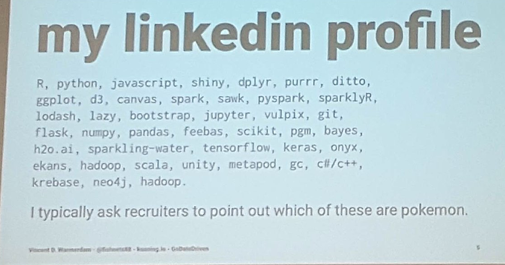

This app helps recruiters sniff out the pokemon amongst the tech terms. Inspriation taken from https://twitter.com/fishnets88 reddit post.

## How to use:
1. Re-cruiter pastes the terms in text field
2. Click de-pokeify button.
3. De-pokeify sniffs out the pokemon. 
4. Displays the pokemon found
5. Displays the tech terms?

## Tech Specs
* Flask app